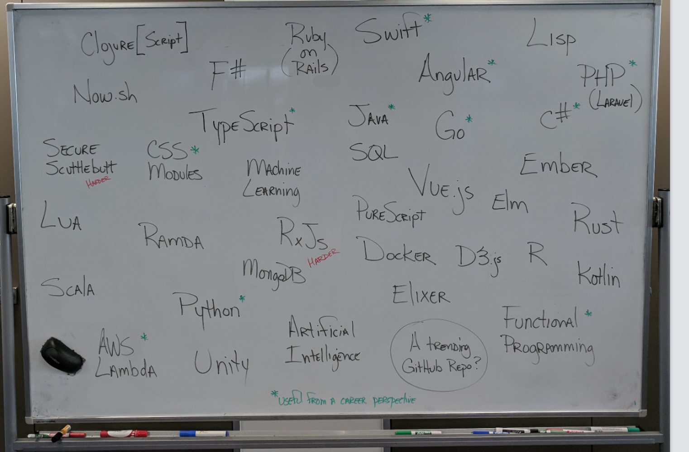

# Thunder talks

Toward the end of the course the focus shifts towards more self-directed learning. Week 7 is an excellent time for students to take stock of their skill sets and work on specific tools before beginning their multi-day projects on the Thursday.

Core skills this practice targets:

 - Understanding personal learning
 - Researching tools and technologies
 - Self teaching
 - Doing live code demos
 - Explaining and teaching technologies to others
 - Requirements

The lecture should:

 - clearly introduce the topic
 - talk us through the technology
 - include some live coding/demo
 - be approximately 5 - 10 minutes long

## Topics

It's important you choose a topic you're passionate about. Find something that really interests you and see where it leads! At worst, you may discover you don't really enjoy that area very much (which is useful learning in itself); at best, you launch a new focus you'll follow for years to come.

Here are some prompts for areas to explore. These are _not_ intended to be a restrictive/exhaustive list! Perhaps while searching for more on these topics, you'll uncover something else that excites you.

## Topics

It's important you choose a topic you're passionate about. Find something that really interests you and see where it leads! At worst, you may discover you don't really enjoy that area very much (which is useful learning in itself); at best, you launch a new focus you'll follow for years to come.

Here are some prompts for areas to explore. These are _not_ intended to be a restrictive/exhaustive list! Perhaps while searching for more on these topics, you'll uncover something else that excites you.

- Swift
- Firebase
- ~~PHP~~
- PWAs (Progressive Web Apps)
- Continuous Integration
- Java
- Angular
- GraphQL
- ~~Docker~~
- Vue.js
- ~~AWS Lambda~~
- Ruby (on Rails)
- ~~TypeScript~~
- Functional programming
- Go
- ~~React Native~~
- ~~Artificial Intelligence~~
- CSS modules
- ~~C#~~
- PostgreSQL 
- ~~Python~~
- ~~Redux Toolkit~~

## Signup

*Note: please strikeout your topic once you have chosen it. [Learn about markdown syntax here](https://github.com/adam-p/markdown-here/wiki/Markdown-Cheatsheet#emphasis).*

Student    | Topic
-----------|-------------------
| Angus    |                  |      
| Ben      |      typescript  |                                        
| Crystal  |    Docker              |                    
| Goretti  |Redux Toolkit     |                    
| James    | AWS Lambda       |                    
| Joshua   |Unity                  |                    
| Julianne |    C#            |                    
| Lauren   |Artificial Intelligence/ machine learning|                   
| Nathan   |                  |                    
| Nicky    |      PHP         |                  
| Sean     |Continuous Integration|                  
| Seshan   |                  |                  
| Tane     |                  |                  
| Tommy    | Deployment to Heroku (with PostgreSQL) |                  
| Troy     |                  |                 
| Vimal    |    Python        |                 
| Ying     |                  |                 

